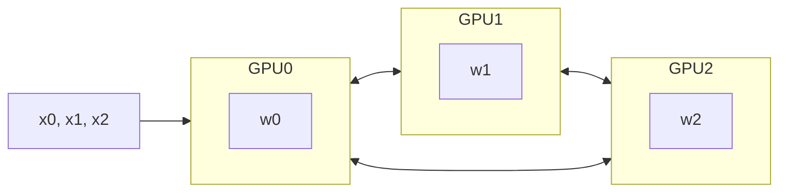
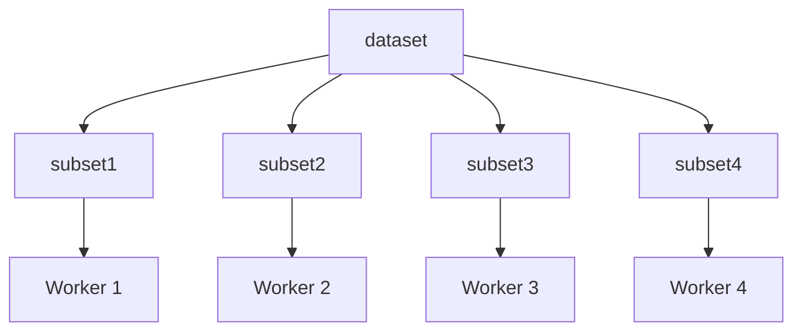
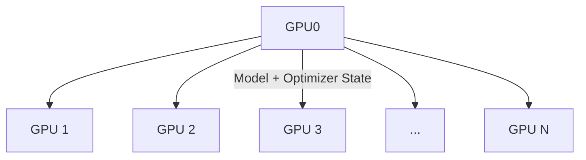
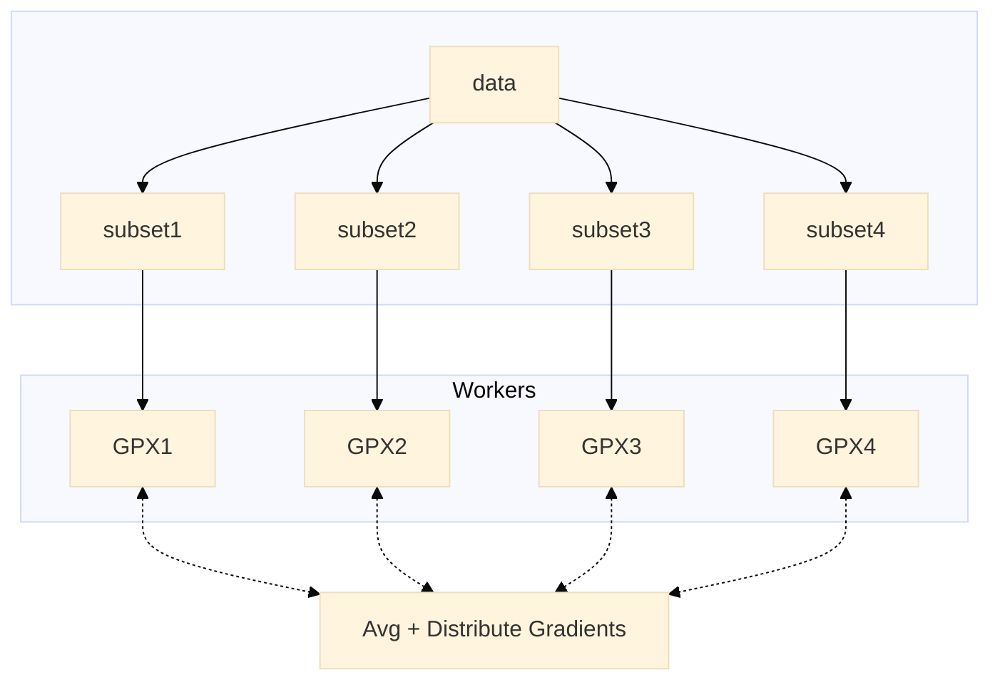
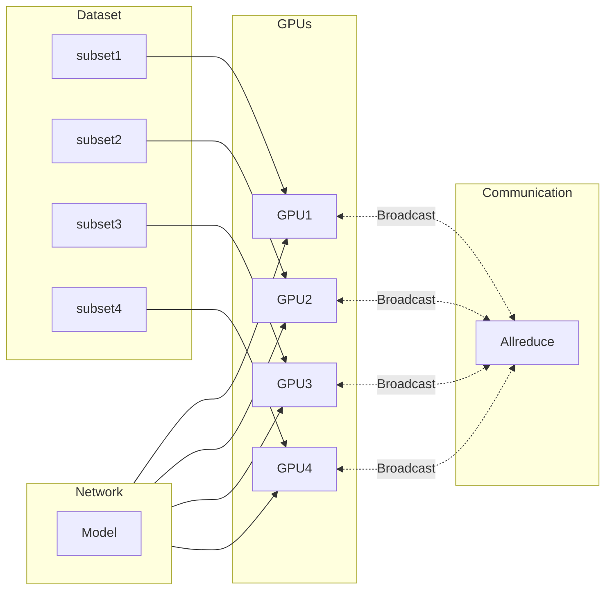

<!-- .slide template="[[template]]" bg="#1c1c1c" -->

<grid align="center" drop="center" drag="70 25" style="background-color:#282828; border-radius:8px;">

<span style="border-bottom:3px solid var(--r-header-accent); font-weight:800; font-size:1.75em; margin-bottom:0px;">Large Scale Training</span>

<span style="font-size:0.8em; line-height:0.8em; margin-bottom:0px; margin-top:0px;">[<i class="fab fa-github fa-1x" alt="`fas:Github`"/> argonne-lcf / ai-science-training-series](https://github.com/argonne-lcf/ai-science-training-series)</span> <!-- .element style="color:#00CCFF!important; font-family:'JuliaMono', monospace" -->

</grid>

<grid drag="100 10" drop="0 70" align="bottomleft" >

<a href="https://www.samforeman.me"><i class="fas fa-home fa-1x" alt="`fas:Home`" /></a> Sam Foreman <!-- .element style="color:#505050;" -->

<span style="font-size:0.9em; color:#505050; padding:0px; margin:0px; text-align:center!important;">2022-11-01</span>
</grid>

---

<!-- .slide template="[[template]]" bg="#1C1C1C" -->

# Why Distributed Training?

- Large batches may not fit in GPU memory
- Splitting data across workers --> larger batch size
- Smooth loss landscape
- Improved gradient estimators
- Less iterations needed for same number of epochs
	- May need to train for more epochs if another change is not made
	- e.g. scaling learning rate
- See [Large Batch Training of Convolutional Networks](https://arxiv.org/abs/1708.03888)


---

<!-- .slide bg="#1C1C1C" -->

 <!-- .element style="width:90%;" align="center" -->


---

<!-- .slide template="[[template]]" bg="#1c1c1c" -->

# Recent Progress

|              Year               |                  Author                  |            Batch Size            |                  Processor                  |           DL Library            |                Time                |                         Accuracy |
|:-------------------------------:|:----------------------------------------:|:--------------------------------:|:-------------------------------------------:|:-------------------------------:|:----------------------------------:| --------------------------------:|
| <span id="blue">2016</span> |   <span id="blue">He et al. [1]</span>   |    <span id="blue">256</span>    |    <span id="blue">Tesla P100 x8</span>     |  <span id="blue">Caffe</span>   |              <span id="blue">29 Hrs</span>               |                            <span id="blue">75.3%</span> |
|                                 |             Goyal et al. [2]             |               8192               |                 Tesla P100                  |             Caffe 2             |               1 hour               |                            76.3% |
|                                 |             Smith et al. [3]             |         8192 ->  16,384          |                full TPU pod                 |           TensorFlow            |              30 mins               |                            76.1% |
|                                 |             Akiba et al. [4]             |              32,768              |              Tesla P100 x1024               |             Chainer             |              15 mins               |                            74.9% |
|                                 |              Jia et al. [5]              |              65,536              |              Tesla P40  x2048               |           TensorFLow            |              6.6 mins              |                            75.8% |
|                                 |             Ying et al. [6]              |              65,536              |                TPU v3 x1024                 |           TensorFlow            |              1.8 mins              |                            75.2% |
|                                 |            Mikami et al. [7]             |              55,296              |              Tesla V100 x3456               |               NNL               |              2.0 mins              |                           75.29% |
| <span id="red">**2019**</span>  | <span id="red">**Yamazaki et al**</span> | <span id="red">**81,920**</span> | <span id="red">**Tesla V100 x 2048**</span> | <span id="red">**MXNet**</span> | <span id="red">**1.2 mins**</span> | <span id="red">**75.08%**</span> |
<!-- .element style="font-size:0.8em;" -->

---

<!-- .slide template="[[template]]" bg="#1C1C1C" -->

# Model Parallel Training <!-- .element style="font-size:2.0em;" -->

---

<!-- .slide template="[[template]]" bg="#1C1C1C" -->

<grid drop="0 0" drag="55 100">

# Model Parallel Training

- Split up network over multiple workers

  - Each receives disjoint subset
  - All communication associated with subsets are distributed

- Communication whenever dataflow between two subsets

- Typically **more complicated** to implement than data parallel training

- Suitable when the model is too large to fit onto a single device (CPU / GPU)
</grid>

<grid drop="60 0" drag="40 100">


</grid>

---

<!-- .slide template="[[template]]" bg="#1c1c1c" -->

# Model Parallel Training

$$y = w_0 * x_0 + w_1 * x_1 + w_2 * x_2$$

1. Compute $y_{0} = w_{0} * x_{0}$ and send to --> `GPU1`
2. Compute $y_{1} = y_{0} + w_{1} * x_{1}$ and send to --> `GPU2`
3. Compute $y = y_{1} * w_{2} * x_{2}$ ✅



<!-- .element align="center" -->

---


<!-- .slide template="[[template]]" bg="#1C1C1C" -->

# Data Parallel Training <!-- .element style="font-size:2.0em;" -->

---

<!-- .slide template="[[template]]" bg="#1C1C1C" -->

<grid drop="0 0" drag="50 100" style="text-align:left!important;">

# Data Parallel Training

- Each worker has identical copy of complete model
- Each Worker computes the corresponding loss and gradients w.r.t **local** data
- Before updating parameters, loss and gradients averaged across workers
- Typically easier / simpler to implement

</grid>

<grid drop="60 0" drag="40 100">

 <!-- .element style="width:80%;" align="left" -->
</grid>


---

<!-- slide template="[[template]]" bg="#1c1c1c"-->

# Data Parallel Training

- Each worker has identical copy of model
- **Global batch of data split across workers**
- Loss + Grads averaged across workers before updating parameters


<!-- .element align="center" -->


---

<!-- .slide template="[[template]]" bg="#1c1c1c" -->

# Broadcast Initial State

- At the start of training (or when loading from a checkpoint), we want all of our workers to be initialized consistently
	- **Broadcast** the model and optimizer states from `hvd.rank() == 0` worker


<!-- .element align="center" -->

---

<!-- .slide template="[[template]]" bg="#1c1c1c" -->

# Data Parallel Training

<split left="2" right="3">

- Disjoint subsets of a neural network are assigned to different devices
- Each worker receives:
	- **identical copy of model**
	- **unique subset of data**


<!-- .element align="right" -->
</split>

---

<!-- .slide template="[[template]]" bg="#1c1c1c" -->


<!-- .element align="center" -->


---


<!-- .slide template="[[template]]" bg="#1c1c1c" -->

# TensorFlow + Horovod

- Set one GPU per process ID (`hvd.local_rank()`)
  ```python
  gpus = tf.config.experimental.list_physical_devices('GPU')
  for gpu in gpus:
      tf.config.experimental.set_memory_growth(gpu, True)
  if gpus:
      local_rank = hvd.local_rank()
      tf.config.experimental.set_visible_devices(gpus[local_rank], 'GPU')
  ```

---

<!-- .slide template="[[template]]" bg="#1c1c1c" -->

# Scale the Learning Rate

- Scale the learning rate by the number of workers to account for the increased batch size
  ```python
  import horovod.tensorflow as hvd
  optimizer = tf.optimizers.Adam(lr_init * hvd.size())
  ```

---

<!-- .slide template="[[template]]" bg="#1c1c1c" -->

# Thank you!

- Organizers
- ALCF Data Science & Operations

- Feel free to reach out!
  <split even >

    [<i class="fas fa-home"></i>](https://samforeman.me)
    [<i class="far fa-paper-plane"></i>](mailto:///foremans@anl.gov)
    [<i class="fab fa-twitter"></i>](https://www.twitter.com/saforem2)
     </split>

> [!INFO] Acknowledgements
> This research used resources of the Argonne Leadership Computing Facility, which is a DOE Office of Science User Facility supported under Contract DE-AC02-06CH11357.
<!-- .element style="max-width:90%;" -->

---


<style>

:root {
	--callout-radius:5px;
  --r-math-color:#FAFAFA;
	--cm-inline-background: #242424;
	--cm-inline-foreground: #00CCFF;
    --r-heading-text-transform: none;
    --primaryBorderColor: #666666;
    --r-heading-font: 'Inter', 'Arial', "OpenSans-Bold", "Open Sans", Helvetica, Impact, sans-serif;
    --r-main-background-color: #1c1c1c!important;
    --r-main-font: 'Inter', "Arial", "Open Sans", "Coming Soon", "SourceSansPro", Helvetica Neue, sans-serif;
    --r-heading-letter-spacing: -0.45px;
    --r-heading-word-spacing: 0.5px;
    --r-heading-text-transform: none;
    --r-heading-text-shadow: none;
    --r-heading-font-weight: 700;
    --r-heading1-text-shadow: none;
    --r-main-font-size: 22px;
	--r-main-line-height: 1.5em;
    --r-monospace-font-size: 18px;
    --r-heading1-size: 1.33em;
    --r-heading2-size: 1.25em;
    --r-heading3-size: 1.2em;
    --r-heading4-size: 1.15em;
    --r-heading5-size: 1.05em;
    --r-heading6-size: 1.025em;
    --r-heading-line-height:1.5em;
    --r-main-font-family: 'Inter';
    --r-code-font: 'JuliaMono', 'Hack', 'VictorMono', "agave Nerd Font", monospace;
    --r-link-color: #03A9F4;
    --r-link-color-dark: #f92672;
    --r-link-color-hover: #63ff51;
	--r-accent-color: #77CA29;
    --r-controls-color: #228BE6;
    --r-progress-color: #404040;
	--r-header-accent: #1E8BC9;
    --r-selection-background-color: rgba(255, 255, 0, 0.15);
    --r-selection-color: rgb(255, 255, 0);
    --r-main-color: #c8c8c8;
    --text-muted: #757575;
    --text-faint: #404040;
    --r-heading-color: #FFF;
    --r-background-color: #ffffff;
	--cm-keyword: #c792ea;
	--cm-atom: #f78c6c;
	--cm-number: #ff5370;
	--cm-type: #decb6b;
	--cm-def: #82aaff;
	--cm-property: #c792ea;
	--cm-variable: #f07178;
	--cm-variable-2: #EEFFFF;
	--cm-variable-3: #f07178;
	--cm-definition: #82aaff;
	--cm-callee: #89ddff;
	--cm-qualifier: #decb6b;
	--cm-operator: #89ddff;
	--cm-hr: #98e342;
	--cm-link: #696d70;
	--cm-error-bg: #ff5370;
	--cm-header: #da7dae;
	--cm-builtin: #ffcb6b;
	--cm-meta: #ffcb6b;
	--cm-matching-bracket: #FFFFFF;
	--cm-tag: #ff5370;
	--cm-tag-in-comment: #ff5370;
	--cm-string-2: #f07178;
	--cm-bracket: #ff5370;
	--cm-comment: #676e95;
	--cm-string: #c3e88d;
	--cm-attribute: #c792ea;
	--cm-attribute-in-comment: #c792ea;
	--cm-background-color: #202020;
	--cm-active-line-background-color: #353a50;
	--cm-foreground-color: #bdbdbd;
      -webkit-font-smoothing:subpixel-antialiased;
	--chart-color-1: #ff00ff;
	--chart-color-x: rgb(255,255,255);
}

.standout{
	background: var(--cm-background-color);
	padding:5px;
	font-weight:700;
	border-radius:6px;
}

.reveal pre {
  display:block;
  margin:auto;
  width:auto;
  font-family: var(--r-code-font);
  font-size: var(--r-monospace-font-size);
  padding: auto;
  white-space: pre-wrap;
}

.reveal p {
  margin:auto!important;
  padding:auto!important;
}

.reveal pre code {
    display: inline-block;
	top: 2px;
	white-space: pre;
    bottom: 2px;
	margin:auto;
	padding:auto;
    font-size: 0.8em;
    background:var(--cm-background-color);
    color: var(--cm-foreground-color)!important;
	text-align: justify;
    letter-spacing: -0.45px!important;
    word-spacing: -0.5px!important;
}

.reveal {
    font-family: var(--r-main-font), sans-serif;
    font-size: var(--r-main-font-size);
    font-weight: normal;
    color: var(--r-main-color);
    background-color: var(--r-main-background-color);
}


.reveal blockquote p {
  color: var(--text-muted);
  font-style: normal !important;
  font-align: left;
  display: inline;
  text-align: left;
}

.reveal blockquote em{
  color: var(--text-muted);
  text-align: left;
}

.reveal blockquote {
  border-radius: 8px !important;
  margin: 0.5rem 0rem 0.5rem 0rem;
  text-align: left;
  padding-top: 1rem;
  padding-left: 2rem;
  padding-bottom: 1rem;
  padding-right: 2rem;
  width: auto;
  font-style: normal !important;
}

.reveal blockquote {
	font-size: unset;
	margin: auto;
	padding:auto;
}


.reveal ul, ol {
	text-align:left;
}

.reveal ul ul,
.reveal ul ol,
.reveal ol ol,
.reveal ol ul {
  text-align:left;
}

.reveal ul ul {
    list-style: circle;
}
.container {
  position: relative;
}

.make-it-pop {
  filter: drop-shadow(0 0 10px purple);
}

.bottomright {
  position: absolute;
  bottom: 8px;
  right: 16px;
  font-size: 18px;
}


@media (max-width: 95%) {
  section {
    -webkit-flex-direction: column;
    flex-direction: column;
  }
}

.row {
  display: flex;
}

.column {
  flex: 50%;
}

.horizontal_dotted_line{
  border-bottom: 2px dotted gray;
}

.footer {
  font-size: 60%;
  vertical-align:bottom;
  color:#bdbdbd;
  font-weight:400;
  margin-left:-5px;
}
.note {
  color:#f8f8f8;
  border-radius:8px;
  background-color:#35353540;
  width: max-content;
  border-color:#66666640;
  padding: auto;
  margin:auto;
}

#blue {
  color: #00CCFF;
}

#red {
  color: #FF5252;
}


.callout {
  overflow: hidden;
  border-style: none;
  border-color: rgba(var(--callout-color), var(--callout-border-opacity));
  border-width: var(--callout-border-width);
  border-radius: var(--callout-radius);
  margin: 1em 0;
  mix-blend-mode: var(--callout-blend-mode);
  background-color: rgba(var(--callout-color), 0.1);
  padding: var(--callout-padding);

}

.reveal .code-wrapper code {
	width: 98%;
}
.reveal code {
  font-family: var(--r-code-font);
  text-transform: none;
  tab-size: 4;
  /*border:1px solid red;*/
  background:var(--cm-background-color);
  color: var(--cm-foreground-color);
  border-radius:2px;
  letter-spacing: -0.45px!important;
  word-spacing: -0.5px!important;
}

.reveal pre code {
	padding: auto;
	border:none;
	border-radius:2px;
	font-size:0.9em;
	margin:auto;
	background: var(--cm-background-color);
}
.reveal p code {
  font-family: var(--r-code-font);
  text-transform: none;
  tab-size: 4;
  padding:auto;
  /* border:1px solid green; */
  font-size:0.9em!important;
  line-height:inherit;
  background:var(--cm-inline-background);
  color: var(--cm-inline-foreground);
  border-radius:3px;
  letter-spacing: -0.45px!important;
  word-spacing: -0.5px!important;
}

mjx-container[jax="CHTML"][display="true"] mjx-math {
  color: var(--r-math-color);
}

mjx-math {
  color: var(--r-math-color);
  background: none!important;
  padding:unset;
  vertical-align:inherit;
}
#customcontrols > ul {
  display: none!important;
}

#customcontrols button {
  display: none!important;
}

.reveal .slides > section.present, .reveal .slides > section > section.present {
  min-height: 100% !important;
  display: flex !important;
  flex-direction: column !important;
  justify-content: center !important;
  position: absolute !important;
  top: 0 !important;
}
section > h1 {
  position: absolute !important;
  top: 0 !important;
  margin-left: auto !important;
  margin-right: auto !important;
  left: 0 !important;
  right: 0 !important;
}

h1 {
	border-bottom: 3px solid var(--r-header-accent);
	text-align: left!important;
	min-width: max-content;
	max-width: min-content;
}

.print-pdf .reveal .slides > section.present, .print-pdf .reveal .slides > section > section.present {
  min-height: 770px !important;
  position: relative !important;
}

.hljs {
    background: var(--cm-background-color) !important;
	font-size:inherit;
}

.hljs-main {
	color: #ff5252
}

.hljs-built_in {
  color: #63ff5b;
}

.hljs-comment, .hljs-quote, .hljs-deletion, .hljs-meta {
	color: #454545;
}

.hljs-params{
	color: #03A9F4;
}

.hljs-meta {
	color: #AE81FF;
}

.hljs-string {
	color: #FFFF00;
}

strong {
	color: #FF5252!important;
	font-weight: 700;
}

ul {
	margin-left: 0;
	padding-left:1em;
}

ol {
	margin-left: 0;
	padding-left:1em;
}

.reveal .code-wrapper code {
 st white-space: unset;
}

.reveal pre {
white-space: pre-wrap;
}

.reveal sup {
	font-size:0.6em;
}

</style>
